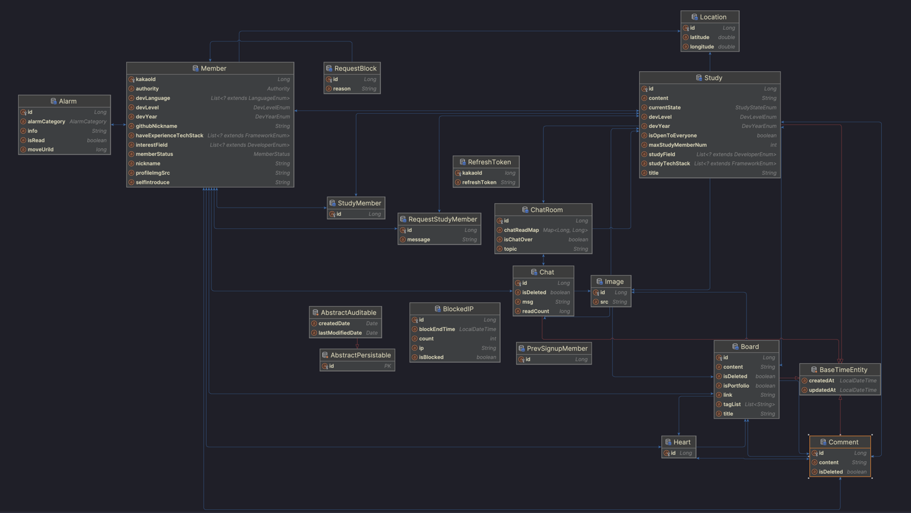

# 개요
sddody 프로젝트의 코드 참조를 위한 레포지토리입니다

# 사용 기술
- Kotlin
- Android Studio
- SpringBoot
  - JPA
  - Security
  - Aspect
- AWS EC2
- MySQL
- Docker

# 아키텍쳐

# 초기 설계 다이어그램

# ERD

# 기능
핵심 기능은 일일이 상대 개발자의 역량파악할 필요없는 팀플 모집 및 참가입니다 

## 유저 관련 기능
- OAuth 로그인(카카오)
- 관심있는 프레임워크, 역량 등 카테고리 설정
- 비정상적 유저 차단기능
- 유저 정보 수정
- 깃허브 연동  

## 관심있는 카테고리 기반 스터디 추천 및 자동 생성
- 자신의 경력,전공,프레임워크를 이용해서 스터디를 추천합니다.
- 그 외에도 추천에 좀 더 가중치를 두기위해 
  2023 프로그래머스에서 설문조사한 데이터를 이용해 추천하도록 하였습니다.

   
[스터디 추천 부분]

## 스터디 
- 자신이 관심있다고 선택한 개발 프레임워크,수준에 기반하여 스터디 추천
- 그 외에도 여러 정렬기능을 구현하였습니다.
  - 가까운 순
  - 내가 관심있는 프레임워크 순
  - 최근 순 
- 필요 역량,프레임워크,전공 등 입력가능
- 신청한 상대 포트폴리오,깃허브 컨트리뷰션 확인 가능
- 생성된 스터디에서 채팅가능
- 그 외 멤버 추방 등 기능을 구현하였습니다.

# 번외
- 번외로 중복된 로그 코드를 줄이고자 Spring Aspect를 구현하여 로깅부분을 개선하였습니다.   
[참조] https://github.com/PraiseBak/TimeLog

# 기술적 쟁점
- 어떻게 상대 개발자의 역량을 파악할 수 있을까?    
  - 여러 개발자 커뮤니티에서 설문조사등을 파악한 결과 다음의 정보들을 스터디 모집에 관심있는 개발자 역량으로 파악하였습니다.    
  - 사용 프레임워크   
  - 깃허브 내역   
  - 경력   
  - 전공자 유무   
- 어떻게 신뢰성 있는 추천을 해줄 수 있을까?   
  - 사용자의 개발자 역량을 파악과 거기에 더해 2023 프로그래머스의 통계를 이용하여 유사한 스터디를 추천하도록 구현하였습니다.

# 개선점
- 리팩토링
- 낮은 테스트 커버리지
